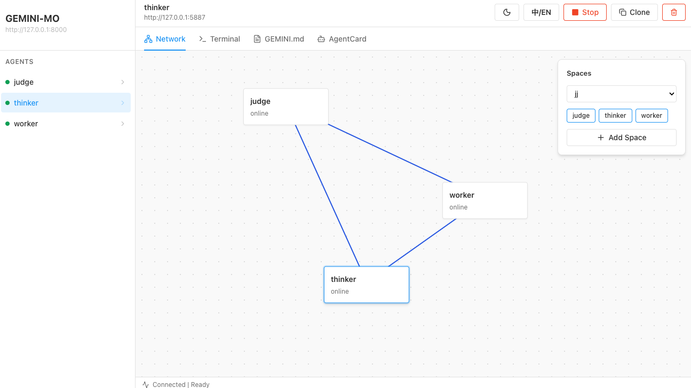
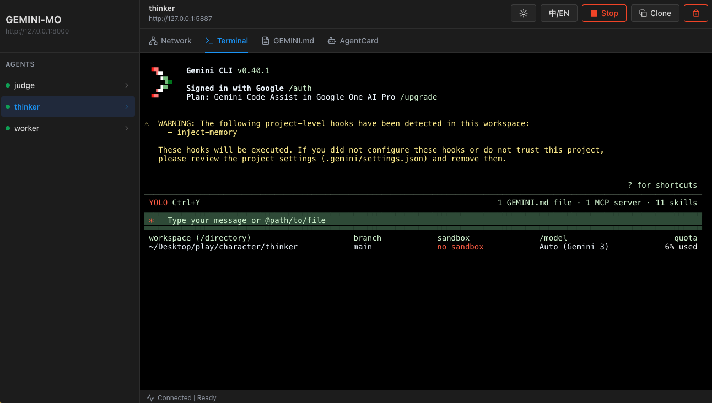

<p align="center">
  
</p>

<h1 align="center">GEMINI-MO</h1>
<p align="center">A visual multi-agent console for orchestrating Gemini CLI agents</p>

<p align="center">
  <a href="README.md">English</a> | <a href="README_zh-CN.md">中文</a>
</p>

---

## Screenshots

<table>
  <tr>
    <td></td>
    <td></td>
  </tr>
  <tr>
    <td align="center"><em>Network topology — drag agents, create spaces and connect them</em></td>
    <td align="center"><em>Live terminal — directly interact with each Gemini CLI agent</em></td>
  </tr>
</table>

---

## Features

- 🕸️ **Visual Network Graph** — drag-and-drop layout, persistent positions, real-time connection lines colored by space
- 🖥️ **Embedded Terminal** — full xterm.js terminal wired to each agent's PTY, with truecolor support
- 🤖 **Multi-Agent Management** — start, stop, clone and delete agents from the UI
- 💬 **Agent-to-Agent Messaging** — Gemini CLI agents can send messages and files directly to each other via the central server, enabling real collaborative workflows
- 🌐 **Communication Spaces** — group agents into named spaces to control which agents can communicate
- 🌙 **Dark / Light Theme** — one-click toggle, persisted in localStorage
- 🌏 **i18n** — English / Chinese UI (default: English)
- ⚡ **Dynamic Port Allocation** — auto-detects free ports, no manual configuration needed

---

## Quick Start

### macOS / Linux

**First-time setup** (installs `uv`, Python deps, Node deps, then starts everything):
```bash
chmod +x start.sh && ./start.sh
```

**Fast restart** (skip dependency install, just start services):
```bash
chmod +x start_all.sh && ./start_all.sh
```

### Windows

**First-time setup** (auto-installs `uv` via PowerShell if missing):
```cmd
start.bat
```

---

## Requirements

| Dependency | Version | Notes |
|---|---|---|
| Python | ≥ 3.10 | Managed by `uv` |
| Node.js | ≥ 18 | For the frontend |
| [uv](https://github.com/astral-sh/uv) | latest | Auto-installed by `start.sh` |
| [Gemini CLI](https://github.com/google-gemini/gemini-cli) | latest | Install via `npm i -g @google/gemini-cli` |

---

## Project Structure

```
character/
├── central_server.py     # Central FastAPI server — routes messages, manages agents
├── agent_host.py         # Per-agent FastAPI host — spawns Gemini CLI in a PTY
├── worker/               # Worker agent workspace
├── judge/                # Judge agent workspace
├── frontend/             # React + Vite UI
│   └── src/
│       ├── App.jsx       # Main UI component
│       └── App.css       # Design system + dark theme
├── start.sh              # One-click setup & start (macOS/Linux)
├── start.bat             # One-click setup & start (Windows)
├── start_all.sh          # Fast restart (no dependency checks)
└── docs/
    ├── logo.png
    └── screenshots/
```

---

## Agent Communication

One of the core features of GEMINI-MO is enabling **Gemini CLI agents to communicate with each other autonomously**.

Each agent runs with `--yolo` mode and has access to MCP tools that let it:
- 📨 **Send messages** to any other online agent by name
- 📁 **Send files** (as base64 payloads) to other agents, which are written to the recipient's workspace
- 📬 **Receive messages** asynchronously — if the target agent is offline, the message is queued and delivered when it comes back online

This means you can ask a `worker` agent to complete a task and automatically forward its output to a `judge` agent for review — all without any manual copy-paste.

---

## Architecture

```
Browser (React UI)
      │
      ▼
Central Server (FastAPI :8000)
      │
      ├── Worker Agent (:5001+)
      │       └── gemini --yolo  (PTY)
      │
      └── Judge Agent  (:5002+)
              └── gemini --yolo  (PTY)
```

Each agent runs inside a PTY managed by `agent_host.py`, which exposes a WebSocket terminal and registers itself with the central server on startup.
